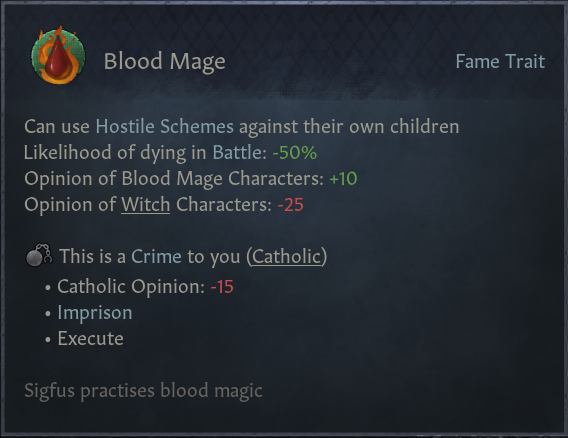

# CK3 Blood Mage Mod
A mod to add a blood mage trait into the game. 

Blood mages are able to prolong their life, by draining the life force from other humans. This process unfortunately kills the target in the process. Blood mages are also able to absorb extraordinatry traits, such as hale or quick, by draining them from their targets

# Development plans:
https://trello.com/b/1qS7Y4n0/ck3-blood-mage-mod
