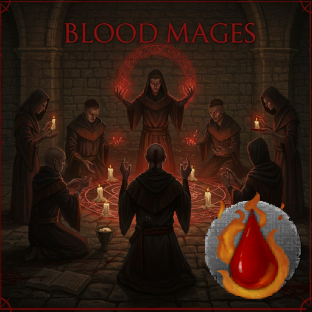

# CK3 Blood Mage Mod
The aim of this mod, is to make a magical playthrough work from a roleplay perspective, while not being overpowered. 

It also aims to not overwrite any gamefiles, to ensure `maximum compatibility with other mods`

## What can Blood Mages do? 
Blood mages rely heavily on `piety` and a new `lifeforce` modifier which increases their lifespan. 

They can expend their own `lifeforce` in various ways, as well as access a range of other abilities. 

- Spend a **small amount** of `piety` to drain `lifeforce` from prisoners, killing them in the process
- Spend a **large amount** of `piety` for a `chance` to drain a positive trait from prisoners (`giant`, `fecund`, etc), killing them in the process
- Spend a **VERY large amount** of faith for a `chance` to drain a positive levellable trait from prisoners (`hale`, `quick`, `comely`, etc), killing them in the process
    - The higher level the trait is, the more likely the drain is to be successful
    - If the player already has the trait, it becomes less successful
- Grant others the power of `blood magic`, at the cost of their own `lifeforce` and `piety`
- Ask friends to be granted the power of blood magic, at a **VERY large** cost of `piety` 
- Form blood mage covenants, growing in power as the dynasty grows
- A unique blood mage faith, with holy sites on islands, mainly in the Mediterranean. 
- Spend `lifeforce` to gain temporary buffs to their skills
- Unique blood mage duchy building

## Lifeforce modifier (stackable)
The `lifeforce` modifier forms the core of the power of any blood mage. 
It allows the blood mage to prolong their life, as long as they can keep the supply of lifeforce going. 

**Blood mages are _NOT_ immortal.** 

They can be killed just as easily as other humans and are just as susceptible to disease and illness. 

# Development plans
https://trello.com/b/1qS7Y4n0/ck3-blood-mage-mod

Key upcoming features: 

* Unique blood mage Men-at-arms
* Events that effect `lifeforce`
* Imbue artefacts with lifeforce (1.5)
