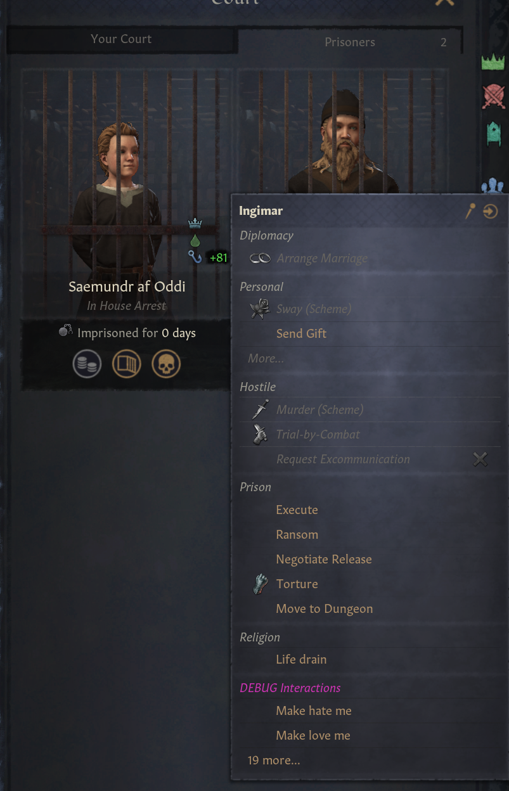
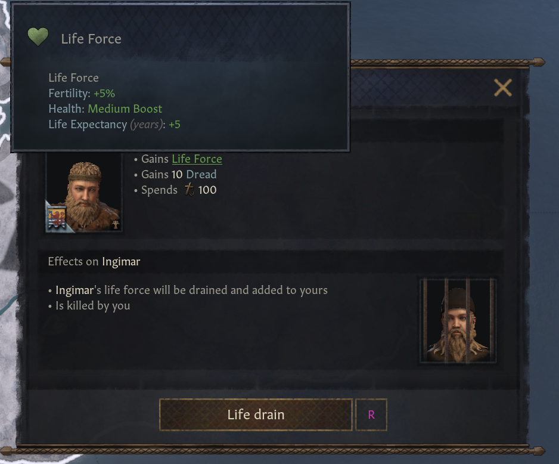
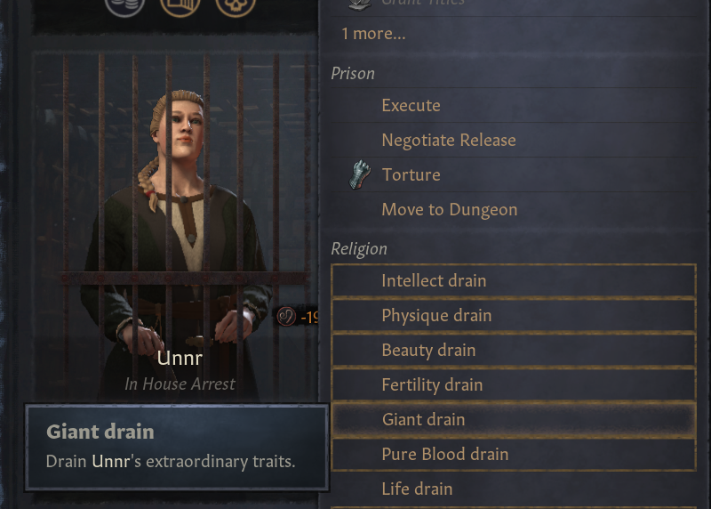

# Overview
TBD

# Screenshots

## Lifedrain

### Interaction with prisoner

### Popup from lifedrain

### Lifedrain modifier (stackable)
Each effect is one instance of it. So in this case, the effect shown is applied 3 times: 

- Fertilty: +15%
- Health: Medium Boost x3
- Life Expectancy: +15

### Interaction with prisoners with positive congenial traits

### Interaction with prisoner that has multiple positive traits
Only the available ones are shown

### Popup when draining a particular positive trait
You can only choose one trait to be drained at a time.

