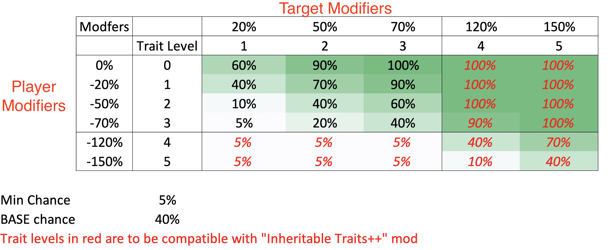

# Overview
TBD

# Probablity of getting traits from trait draining

The probability of getting traits will be based on multiple factors:
- base chance
- level of player trait
- level of target trait
- learning challenge between the player and the target

On succes:

- If the player doesn't have the trait, they will receive the first level of the trait
- If the player aready has the trait, it's level will increase by 1

The `chance of success` will be calculated as follows
```
base_chance = 40%

trait_diff_chance = base_chance  + target_trait_level_modifer - player_trait_level_modifier

chance_of_success = trait_diff_chance + difference_in_learrning_modifier
```
Exampes:

- Player with no trait, drains an intelligent character (level 2). They have a 90% trait_diff_chance + difference_in_learrning_modifier of getting the Quick trait (level 1)
- Player with intellligent trait (level 2) drains a genius (level 3) character. They have a 60% trait_diff_chance + difference_in_learrning_modifier of getting the Genius trait (level 3)
- Player with intelligent trait (level 2) drains a quick (levl 1) character. They have a 10% trait_diff_chance + difference_in_learrning_modifier of getting the Genius trait (level 3)

The base chance and player/target trait levels can be visualised as follows:



# Lifedrain
Drain the life force from a prisoner, prolonging your life

### Interaction with prisoner


### Popup from lifedrain


### Lifedrain modifier (stackable)
Each effect is one instance of it. So in this case, the effect shown is applied 3 times: 

- Fertilty: +15%
- Health: Medium Boost x3
- Life Expectancy: +15


# Trait drain
Drain a trait from a prisoner, making you stronger

### Interaction with prisoner that has multiple positive traits
Only the available ones are shown. 

- If you don't have the trait, you will gain it. 
- If you have a lower ranking one (eg. quick), you will gain 1 level higher (intelligent)
- TODO: Make this be a chance, and the better the trait, the higher the chance. Currently it just happens 100% of the time


### Popup when draining a particular positive trait
You can only choose one trait to be drained at a time.


