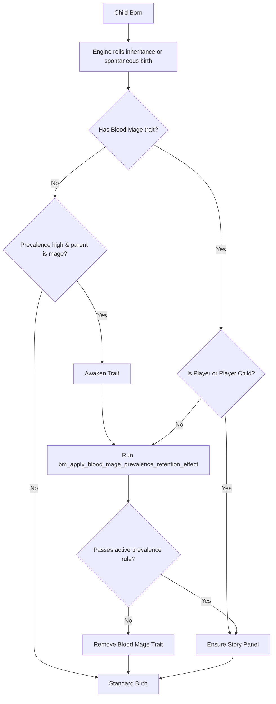

# Blood Mage Trait Inheritance

## Executive Summary

Governs genetic transmission and birth manifestation of blood magic. `lifestyle_blood_mage` uses direct engine inheritance chances rather than CK3 tiered/recessive mechanics. AI newborns audited against campaign prevalence rules at birth. `lifestyle_blood_empowerment` is strictly non-hereditary personal mastery.

## Inheritance Rules & Chances

| Trait | Hereditary Type | Single Parent Chance | Both Parents Chance | Baseline Birth Roll | Notes |
| --- | --- | --- | --- | --- | --- |
| `lifestyle_blood_mage` | Explicit Hereditary (`inheritable = yes`, non-genetic) | 25% | 100% | 0.20% | Audited by prevalence engine on birth. |
| `lifestyle_blood_empowerment` | Non-Hereditary (`inheritable = no`) | 0% | 0% | 0% | Personal occult mastery. Cannot be inherited. |

## Birth Prevalence Auditing Pipeline

## Lineage Enhancement & Trait Theft

- **Positive Trait Transmission:** Blood mages progressing in the Legacy track of Blood Empowerment and enacting Blood Legacy house modifiers increase the odds of descendants inheriting positive inactive traits while suppressing negative genetic traits.
- **Trait Siphoning Bypass:** Direct genetic inheritance can be bypassed via trait draining duels (`bm_drain_trait` interaction). Siphons congenital traits (intellect, beauty, physique) directly into the caster's personal bloodline.

## Mod Conventions & Gotchas

- **Non-Genetic Rule:** Never set `genetic = yes` on `lifestyle_blood_mage`. Genetic traits route into CK3's recessive/tier system, breaking deterministic 25%/100% inheritance.
- **AI Audit Enforcement:** All AI births inheriting blood magic must pass through `bm_apply_blood_mage_prevalence_retention_effect` on `on_birth_child`. Omitting this causes AI blood mages to proliferate uncontrollably and breaks story panel initialization.
- **Player Only Safeguard:** Under `bm_blood_mage_prevalence_player_only`, retention effect strictly wipes trait from any newborn not in the player's direct household.

## File Map

| Piece | File |
| --- | --- |
| Blood Mage trait definition | `common/traits/bm_blood_mage_trait.txt` |
| Blood Empowerment definition | `common/traits/bm_blood_empowerment_trait.txt` |
| Birth on-actions | `common/on_action/bm_blood_mage_prevalence_on_actions.txt` |
| Prevalence retention effect | `common/scripted_effects/bm_blood_mage_lifecycle_effects.txt` |
| Legacy track modifiers | `common/traits/bm_blood_empowerment_trait.txt` |
| Blood Legacy house modifier | `common/modifiers/bm_channel_dynasty_modifiers.txt` |
| Trait drain duel & interactions | `common/character_interactions/bm_drain_trait.txt`, `common/scripted_effects/bm_drain_trait_effects.txt` |
| Prevalence game rules | `common/game_rules/bm_game_rules.txt` (`bm_blood_mage_prevalence`) |
